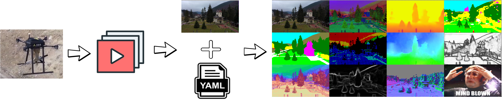

# Video Representation Extractor



## 1. Description

The purpose of this repository is to export various representations starting from RGB videos only. Representations are
defined as ways of 'looking at the world'. One can watch at various levels of information:
- low level: colors, edges
- mid level: depth, orientation of planes (normals)
- high level: semantics and actions

For GitHub users: this is a mirror of the
[gitlab repository](https://gitlab.com/video-representations-extractor/video-representations-extractor).

<u>Supported representations</u>

- See [here](vre/representations/build_representations.py) for a comprehensive list, since it updates faster
than this README.

Weights are stored in this directory using `git-lfs`: [weights dir](./resources/weights/). If you just want to download
the code, without the weights resources, use `GIT_LFS_SKIP_SMUDGE=1 git clone ...`.

## 2. Usage & Installation

### 2.1 Google Colab
Here's is a recent google colab run: [link](https://colab.research.google.com/drive/1vAp71H-TLewhF56odv33TkmGwwhuoFJ-?usp=sharing)
that is based in [this examples notebook](examples/semantic_mapper/semantic_mapper.ipynb).

### 2.2 Local installation
Using the VRE CLI tool is as simple as:
```bash
vre <path/to/video.mp4> --config_path <path/to/cfg> -o <path/to/export_dir>
```

**Relevant env variables**
- `VRE_WEIGHTS_DIR` The path where the weights are downloaded from the weights repository. If not set, will be defaulted
in the root of the project in a resources dir.
- `VRE_DEVICE` Some default cfgs will use this to set the device of representations. Usage is:
 `VRE_DEVICE=cuda CUDA_VISIBLE_DEVICES=0 vre ...`. You can of course update the yaml config files to not use this
 pattern.

For testing that the installation works, we recommend you to run with this test video first:
```bash
mkdir example/
chmod 777 -R example/ # required only for docker
curl "https://gitlab.com/video-representations-extractor/video-representations-extractor/-/raw/master/resources/test_video.mp4" \
  -o example/video.mp4 # you can of course use any video, not just our test one
curl https://gitlab.com/video-representations-extractor/video-representations-extractor/-/raw/master/test/end_to_end/imgur/cfg.yaml -o example/cfg.yaml
```

#### 2.2.1 Pip

```
conda create -n vre python=3.11 anaconda # >=3.10 tested
pip install video-representations-extractor
[VRE_DEVICE=cuda CUDA_VISIBLE_DEVICES=0] vre example/video.mp4 --connfig_path example/cfg.yaml -o example
```

#### 2.2.2 Docker
We offer a pre-pushed VRE image in dockerhub.

```
docker run -v `pwd`/example:/app/example -v `pwd`/resources/weights:/app/weights \
  --gpus all -e VRE_DEVICE='cuda' -e VRE_WEIGHTS_DIR=/app/weights \
  meehai/vre:latest /app/example/video.mp4 \
  --config_path /app/example/cfg.yaml -o /app/example/output_dir --start_frame 100 --end_frame 101
```

Note: For the `--gpus all -e VRE_DEVICE='cuda'` part to work, you need to install `nvidia-container-toolkit` as well.
Check NVIDIA's documentation for this. If you are only on a CPU machine, then remove them from the docker run command.

### 2.2.3 Development
You can, of course, clone this repository and add it to your path for development:
```
conda create -n vre python=3.11 anaconda # >=3.10 tested
[GIT_LFS_SKIP_SMUDGE=1] git clone https://gitlab.com/video-representations-extractor/video-representations-extractor [/local/vre/dir]
pip install -r /local/vre/dir/requirements.txt # there's a setup.py file too if you wish
# Add the paths in `~/.bashrc` so it can be accessed globally from the terminal
export PYTHONPATH="$PYTHONPATH:/local/vre/dir"
export PATH="$PATH:/local/vre/dir/cli"
# Check that the installation worked
pytest /local/vre/dir/test # requires that pytest is installed
[VRE_DEVICE=cuda CUDA_VISIBLE_DEVICES=0] bash test/end_to_end/imgur/run.sh # run the e2e test
[VRE_DEVICE=cuda CUDA_VISIBLE_DEVICES=0] vre example/video.mp4 --connfig_path example/cfg.yaml -o example
```

### 2.3 Single image usage

You can get the representations for a single image (or a directory of images) by placing your image in a standalone
directory.

```bash
vre <path/to/dir_of_images> --config_path <path/to/cfg> -o <path/to/export_dir>
```

## 3. Details about inputs and outputs

### 3.1 Video

Any video format that is supported by `ffmpeg`. Representations were mostly tested on UAV-like videos, but they should
be fine for self driving videos or even indoor handheld videos.

### 3.2 Config file

The config file will have the hyperparameters required to instantiate each supported method as well as global
hyperparameters for the output. These parameters are sent to the constructor of each representation, so one can pass
additional semantics to each representation, such as classes of a semantic segmentation or the maximum global depth
value in meters.

High level format:

```yaml
name_of_representation: # spaces work too in the name but it's less desired due to other tools having issues
  type: some high level type (such as depth/dpt, semantic/mask2former, edges/dexined etc.)
  dependencies: [a list of dependencies given by their names]
  parameters: # as defined in the constructor of the implementation
    param1: value1
    param2: value2
  learned_parameters: # applies only to representations that are learned and require weights (only torch atm)
    device: "cuda" # for representations that have in their vre_setup() method a model.to(device) call

name_of_representation_2:
  type: some other type
  name: some other method
  dependencies: [name_of_representation] # since this representation depends on the prev one, it'll be computed after
  parameters: []
  compute_paramters:
    batch_size: 5 # overwrite the global default (that is 1)
  io_parameters:
    image_format: not-set
    binary_format: npy # overwrite the global default (that is npz)
    compress: False
```

Example cfg file: See [out of the box supported representations](test/end_to_end/imgur/cfg.yaml) and the CFG defined
in the [CI process](test/end_to_end/imgur/run.sh) for an actual export that is done at every commit on a real video.

Note: If the topological sort fails (because of cycle dependencies), an error will be thrown.

### 3.3. Output format

All the outputs are going to be stored in the output directory (`--output_dir/-o`) with one file for each frame.
A subdirectory will be created for each representation. We have 2 options right now: binary_format (npz or npy only) and
image_format (png, jpg, whatever is supported by the PIL writer etc.) though we might merge this into a single
'exporter' thsat will receive a list of possible output formats for each representation.

For the above CFG file, 2 subdirectories will be created:

```
/path/to/output_dir/
  name_of_representation/
    npz/ # if binary_format=='npz'
      1.npz, ..., N.npz
    png/ # if image_format=='png'
      1.png, ..., N.png
  name_of_representation_2/
    npz/
      1.npz, ..., N.npz
```

The `cfg.yaml` file for each representation is created so that we know what parameters were used for that
representation.

## 4. CLI tools

In the [cli/](cli) dir we have a bunch of exported tools, besides `vre` itself.

### 4.1 vre_collage

`vre_collage` that takes all the image files (png, jpg etc.) from an output_dir as above and
stacks them together in a single image. This is useful if we want to create a single image of all representations which
can later be turned into a video as well.

Usage:
```
vre_collage /path/to/output_dir --config_path /path/to/config.yaml -o /path/to/collage_dir
[--overwrite] [--video] [--fps] [--output_resolution H W]
```

```
/path/to/collage_dir/
  collage/
    1.png, ..., N.png # 1.png = stack([name_of_representation/png/1.png, name_of_representation_2/png/1.png])
```

Note: you can also get video from a collage dir like this (in case you forgot to set --video or want more control):

```bash
cd /path/to/collage_dir
ffmpeg -start_number 1 -framerate 30 -i %d.png -c:v libx264 -pix_fmt yuv420p /path/to/collage.mp4;
```

### 4.2 vre_reader

The `vre_reader` tool can be used to iterate over the extracted vre dataset from the provided output path.

Usage:
```
vre_reader /path/to/output_dir --config_path /path/to/config.yaml --mode [MODE] [--batch_size B]
[--handle_missing_data H]
```

We have 2 choices for `--mode`:
- `read_one_batch` Reads a single batch at random using `torch.utils.data.DataLoader` and, after reading, it will invoke
the plotting function (similar to `vre_collage`). It only prints the shapes.
- `iterate_all_data` Will iterate the entire dataset to see if the data is corrupted.

Handle missing data is passed to the `MultiTaskDataset` dataset constructor and accepts all the choices from there.
Defaults to 'raise' which will raise an exception if any representation has missing data (i.e. each xxx.npz must be
present for all the representations).
