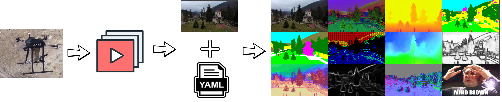

# Video Representation Extractor



Documentation at: [link](https://video-representations-extractor.gitlab.io/video-representations-extractor/).

### Installation

```python
conda create -n vre python=3.11 anaconda # >=3.10 tested
pip install video-representations-extractor
[VRE_DEVICE=cuda CUDA_VISIBLE_DEVICES=0] vre example/video.mp4 --connfig_path example/cfg.yaml -o example/
```

For more details, see usage and installation page: [link](https://video-representations-extractor.gitlab.io/video-representations-extractor/guide/introduction_and_installation.html).

### Google Colab examples

- Batched VRE: Full example from a single test video to complex extracted representations: [link](https://colab.research.google.com/drive/1vAp71H-TLewhF56odv33TkmGwwhuoFJ-?usp=sharing)
- Streaming VRE: Real time Semantic Segmentation on youtube videos: [link](https://colab.research.google.com/drive/1-Zc7qEC7k7KnCuq-LOnNy9hoMfQBJA9O#scrollTo=TR5G9bBhY9_k)
