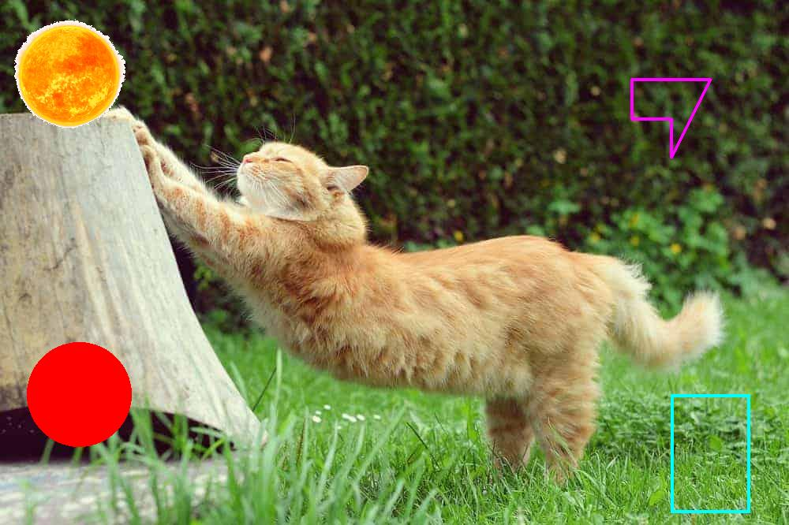

# Image utils in Python

A simpler image-only successor of [media-procesing-lib](https://gitlab.com/meehai/media-processing-lib) with various sane functions for image manipulation that do one one thing based on whatever personal project I'm working on. Uses Pillow as the main backend and numpy arrays as the image buffer (i.e. a ndarray of (H, W, 3) uint8 shape and dtype). Some operations (i.e. `image_resize` have a opencv option too). Everything is in IJ coordinates (badly named UV for now), not XY!

The main idea here is not to "install" this as a package, but rather copy paste it into your project and use it as-is. Kinda like a C header style library (see [stb libraries](https://github.com/nothings/stb)). There's also __init__.py so you can technically `git submodule add ` it, see [link](https://gitlab.com/video-representations-extractor/video-representations-extractor/-/tree/3dee24642c6fc0d777821bad0f769d5014c923d5/).

New functions are welcome as long as they follow the "do one thing only" convention which is of course subjective.
Make sure this passes too: `pylint --rcfile=.pylintrc image_utils.py`.

API Example:

```python
import sys
from image_utils import image_draw_circle, image_draw_polygon, image_resize, image_paste, image_draw_rectangle
from PIL import Image
import numpy as np

def main():
    image_cat = np.array(Image.open(sys.argv[1]), dtype=np.uint8)[..., 0:3]
    image_sun = np.array(Image.open(sys.argv[2]), dtype=np.uint8)[..., 0:3]

    image_sun_rsz = image_resize(image_sun, height=image_sun.shape[0] // 3, width=None) # auto-scale
    # paste image_sun over image_cat starting from the most top-left of image_cat where white of image sun is ignored.
    im1 = image_paste(image_cat, image_sun_rsz, top_left=(0, 0), background_color=(255, 255, 255))
    im2 = image_draw_circle(im1, center=(500, 100), radius=10, color=(255, 0, 0), fill=True)
    points = [(100, 800), (150, 800), (150, 850), (200, 850), (100, 900)]
    im3 = image_draw_polygon(im2, points, color=(255, 0, 255), thickness=0.75)
    im4 = image_draw_rectangle(im3, top_left=(500, 850), bottom_right=(650, 950), color=(0, 255, 255), thickness=0.75)
    Image.fromarray(im4, "RGB").save(sys.argv[3])

if __name__ == "__main__":
    main()

```

And you should get:


